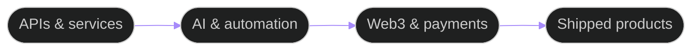

<!-- ═══════════════════════════════════════════════════════════════════════════ -->

 

~4 years · ~22+ Shipped projects · Backends · AI · Web3 · Automation · Dubai 🇦🇪

## ✨ Spotlight

Focused on **backend systems**, **automation**, **AI**, and **blockchain** and on building things that **actually work** and **ship**. Off screen: **cars**, **coding**, **snooker**, and hunting the **best beef burgers** in town.

I'm a **full stack engineer with a strong Python backend** about **four years** in **end-to-end production**: **REST APIs**, **microservices**, **Django**, **FastAPI**, **Flask**, plus **React**, **Vue**, **TypeScript**, and **Tailwind** style frontends where the product needs them.

I care about **OAuth2**, **JWT**, **RBAC**, **OpenAPI** / versioning, **real-time** & **async** flows, **Redis**, **CI/CD**, and **applied AI** (documents, **OCR**, **RAG**, **LLMs**, **speech-to-text**, meeting intelligence). **Web3**, **Ethereum**, **Stripe** / **Authorize.net**, **Docker**, **Kubernetes**, and **AWS** (**EC2**, **ECS**, **S3**) are regular territory.

performance, reliability, maintainability **backend first** when it counts, **full stack** when the product demands it.

### Words from my site

I'm **Shehroz Zaidi** I love **problem solving**, **AI driven products**, and anything that forces me to think differently. I've spent years on **full platforms**, **deep automation**, and **AI powered** systems so every piece **connects** and **performs**. I keep exploring **blockchain** and projects that tie **real world** ops to **new tech**.

When I'm not building: **cars** keep me grounded, **snooker** keeps me patient, **good food** keeps me happy. (Also: **JDM**, **car guy**, **snooker addict**, **tech head** if you know, you know.)

## 🎓 Education

🎓 **BS-SE (B.Sc. Software Engineering)** — **University of Management and Technology (UMT)** · **Dean’s Merit Award**

## 🚀 Projects

*Curated from my portfolio web, blockchain, AI, and automation. Filters on the site match: **Web · Blockchain · Automation · AI · Tools**.*

<b>🌐 Web & platforms</b>

 

| Project | What it is | Link |
|:--|:--|:--|
| **IFund** | Receivables financing & working capital; doc upload, validation, workflows; React + Python/Django + automation | [**ifundfactoring.com**](https://ifundfactoring.com/) |
| **BCR Ltd. UK** | Corporate site — catalogue, lead gen, fast **React + Tailwind** front end | [**bcrprofiles.com**](https://www.bcrprofiles.com/) |
| **Hash Tech** | Services / credibility / lead capture; **React + Tailwind** + Python REST | [**hashtechno.com**](https://hashtechno.com/) |
| **EvocaData (SaaS)** | Lead marketplace & data intel; **React + Tailwind**; Python (**Django**, **FastAPI**), scraping, **Power BI**-style analytics | [**app.avocadata.com**](https://app.avocadata.com/) |
| **SmileFast – CMS** | Custom CMS for marketing ops; **React + Tailwind** admin, **Django** backend | [**smilefast.com**](https://smilefast.com/) |
| **Miami Bikes – CRM** | Retail / wholesale bike ops; leads, inventory, service — **React** + **Python/Django** | [**Portal**](http://miamibikes.onlinecrmpro.com/login.php) |
| **Crypto Card** | Virtual crypto-backed cards, wallets, limits — **React + Tailwind** + **Django** | [**crypto-card.store**](https://crypto-card.store/) |
| **Cyber Arena** | Esports / tournaments / matchmaking — **React** + **Python/Django** | [**cyber-arena.co**](https://cyber-arena.co/) |

<b>⛓️ Blockchain & crypto</b>

 

| Project | What it is | Link |
|:--|:--|:--|
| **Aurpay** | Non-custodial crypto gateway (BTC, ETH, stables, Lightning); **React + Tailwind**, **FastAPI**, Web3, Docker, event-driven automation | [**aurpay.net**](https://aurpay.net/) |
| **All-in-One (AIO)** | Multi-asset crypto acceptance, routing, reporting; **React + FastAPI**, Web3, automation | [**allinone.cash**](https://allinone.cash/) |

<b>🤖 AI, data & intelligence</b>

 

| Project | What it is | Link |
|:--|:--|:--|
| **Zoctor AI** | Medical **RAG** — reports → insights; **FastAPI**, LLM agents, **Vector DB**, embeddings, NLP | [**zoctorai.com**](https://www.zoctorai.com) |
| **FornixAI** | School incident intelligence — **OCR**, LLM extraction, **NLP**, **RAG**, forecasting | [**siap.fornixai.com**](https://siap.fornixai.com/login) |
| **Transcrypt AI** | Meeting intelligence — live **speech-to-text**, translation, minutes; streaming audio, LLM/NLP | [**transcrypt-ai-fe.vercel.app**](https://transcrypt-ai-fe.vercel.app/) |
| **Catch Menu** | AI QR menus for restaurants; **React + Tailwind** + Python; templates & admin | [**catchmenu.com**](https://www.catchmenu.com) |
| **Intelligent OCR & doc processing** | PDFs/scans → structured data; OCR, NLP, **Vector DB**, validation *(internal / NDA)* | *Contact for details* |

<b>⚙️ Automation, bots & internal tools</b>

 

| Build | Notes | Link |
|:--|:--|:--|
| **Discord bot** | Mod, commands, crypto prices — Python, scraping, APIs *(private server)* | *Contact* |
| **Web scraping & automation** | E-com & business data; Selenium, BeautifulSoup, G Suite *(mostly NDA)* | *Contact* |
| **Crypto price tracker** | Alerts, watchlists, dashboards *(internal)* | *Contact* |
| **PDF & Excel automation** | Reporting pipelines, validation *(NDA)* | *Contact* |
| **AI meeting assistant** | STT, multilingual, LLM minutes *(NDA)* | *Contact* |
| **E-commerce deal bot** | Stock/price monitoring, alerts; Selenium/BS4, **React** dashboards *(NDA)* | *Contact* |
| **Network monitoring** | Server/API health, alerts (email/Telegram), **Python**, containers | *Contact* |

## ⚡ Snapshot

 

 

> **Ship the hard stuff first** reliable backends, clear contracts, frontends that don’t fight the data.

22+ portfolio builds above · fintech · SaaS · crypto · internal / NDA tools · <b>open to serious collaboration</b>

## 📡 Connect

| Platform | Link |
|:--:|:--|
| **GitHub** | [**@Zaidi2126**](https://github.com/Zaidi2126) |
| **LinkedIn** | [**shehroz-zaidi-916a8a218**](https://www.linkedin.com/in/shehroz-zaidi-916a8a218) |
| **Upwork** | [**Freelancer profile**](https://www.upwork.com/freelancers/~01f6153eb2d1dcc6ec) |
| **Email** | [**shehroz.z.zaidi@gmail.com**](mailto:shehroz.z.zaidi@gmail.com) |

⚡ Have a project in mind? Email me! I actually reply ⚡

